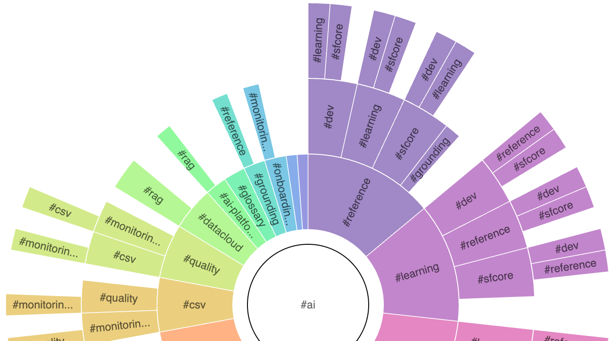

<<<<<<< HEAD
# Obsidian Tag Vis
=======
# Obsidian Tag Vis



This plugin is a plugin for visualizing tags as a sunburst


~~~markdown
```tagvis
{
	"initialTag": "#ai",
	"maxDepth": 2,
    "ignoreTags": [ "#foo", "#archived" ],
	"maxChildren": 15,
	"layout": {
		"width": 800,
		"height": 800
	}
}
```
~~~
>>>>>>> b4470de (Started breaking out the query functionality. Haven't integrated it yet.)
